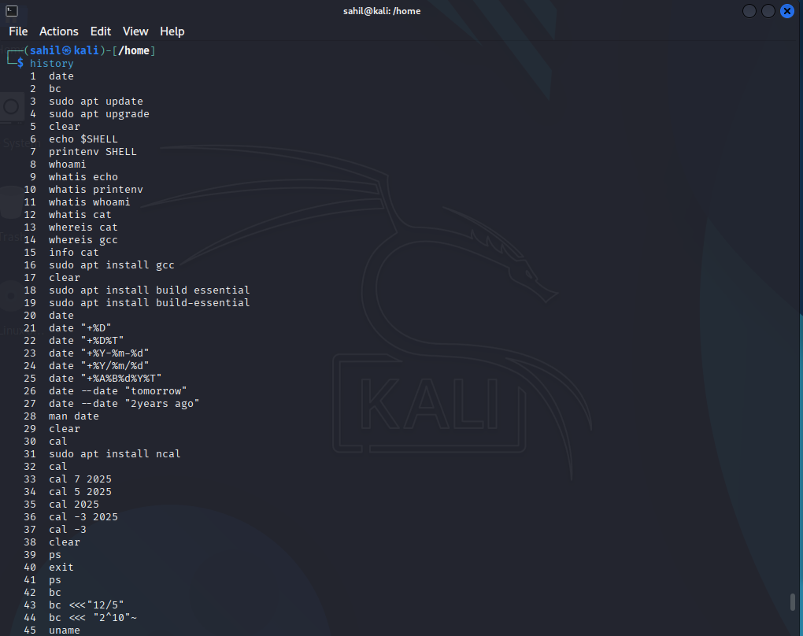
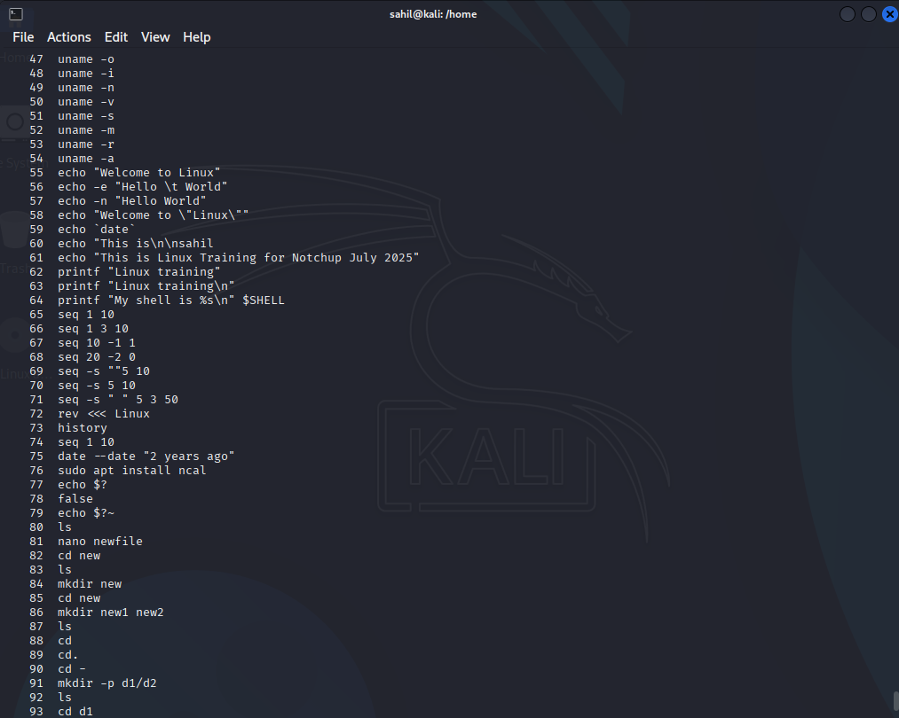
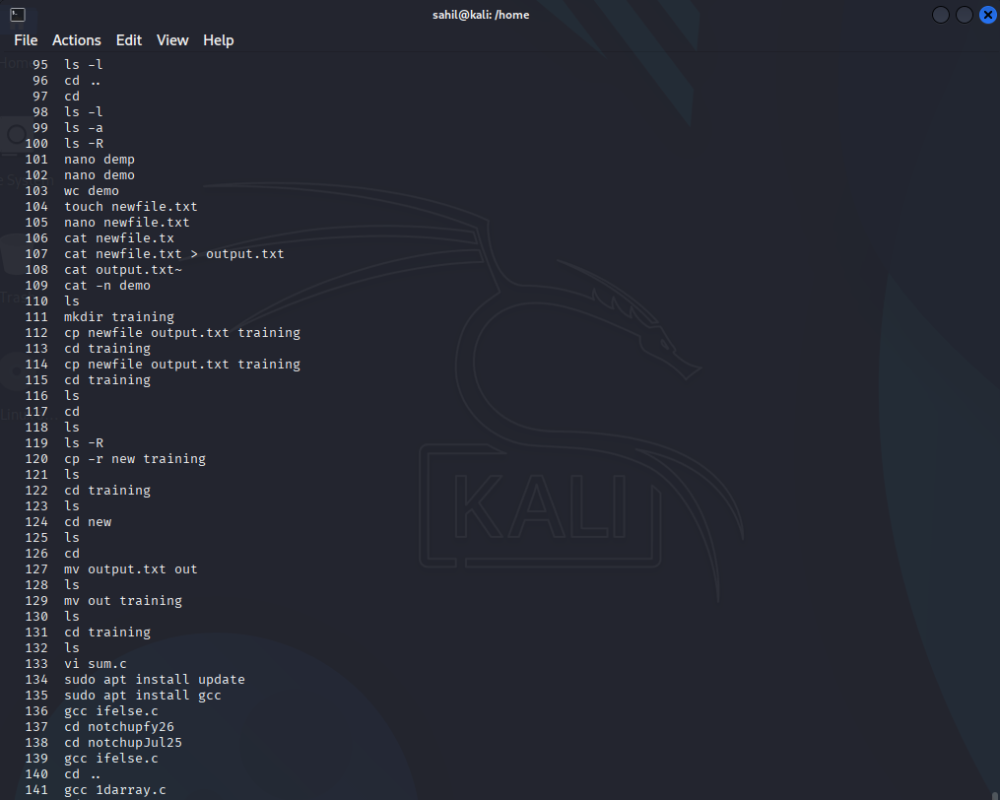
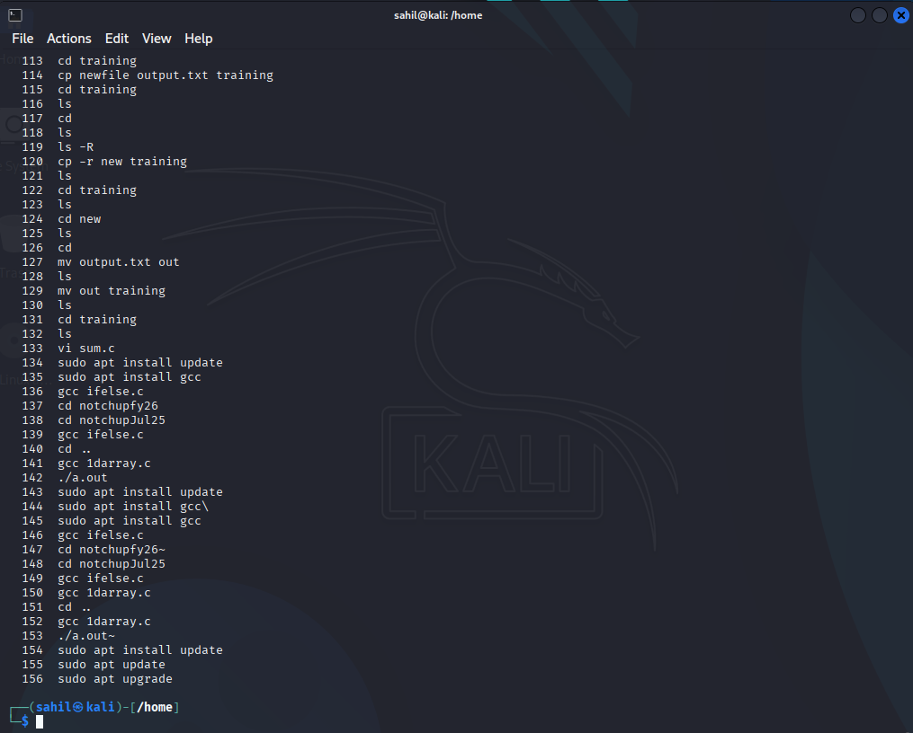
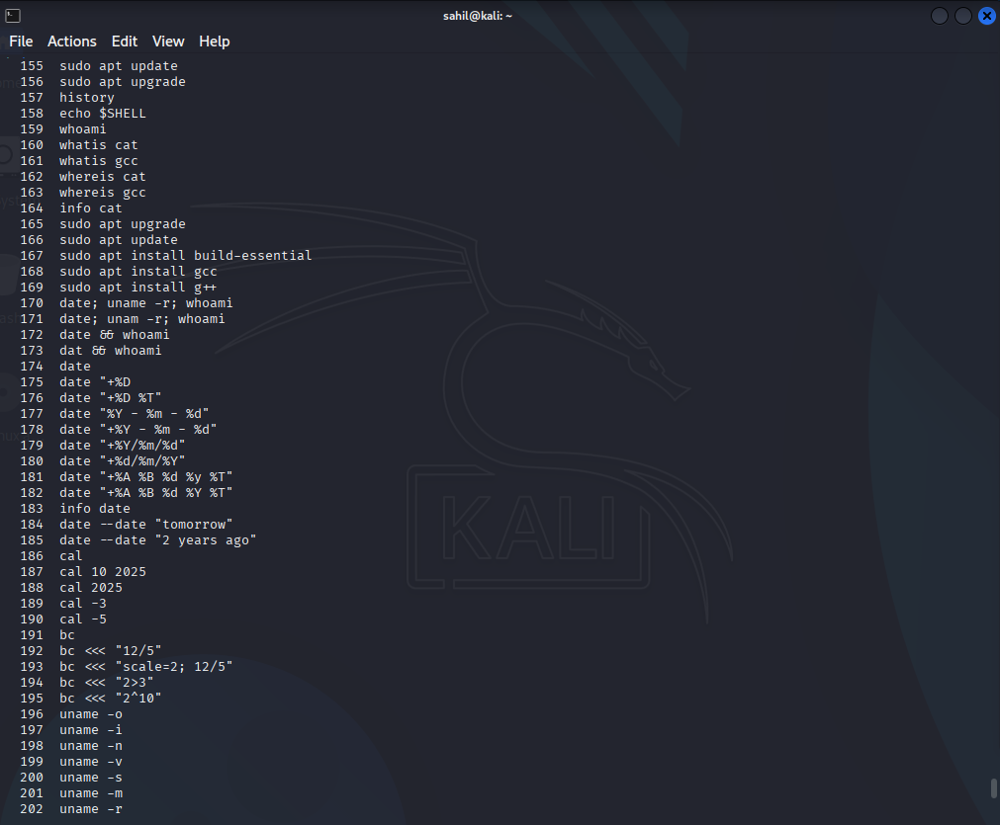
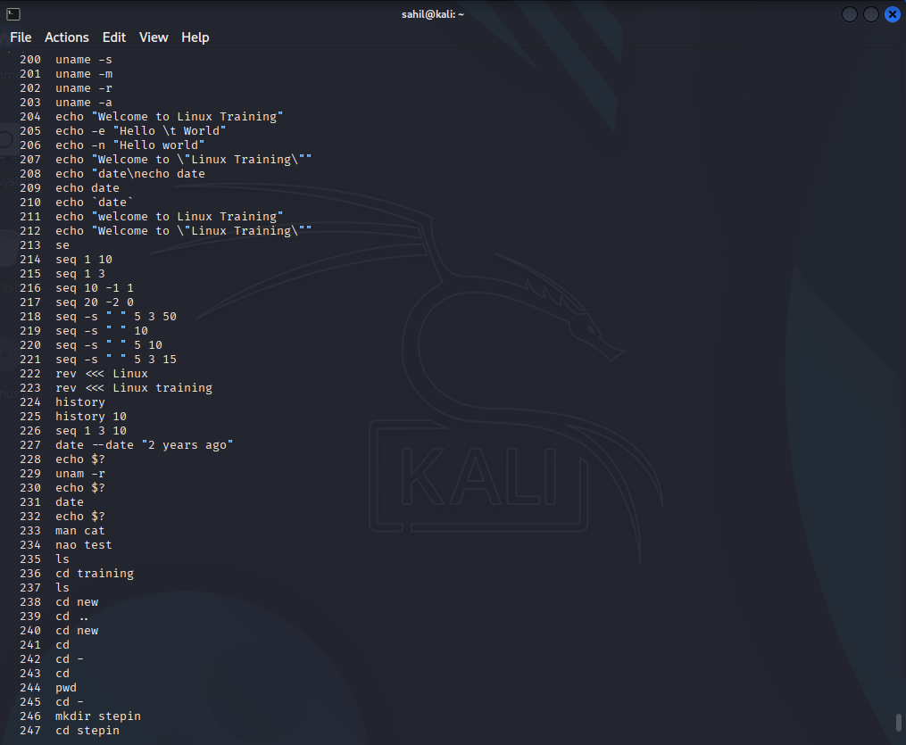
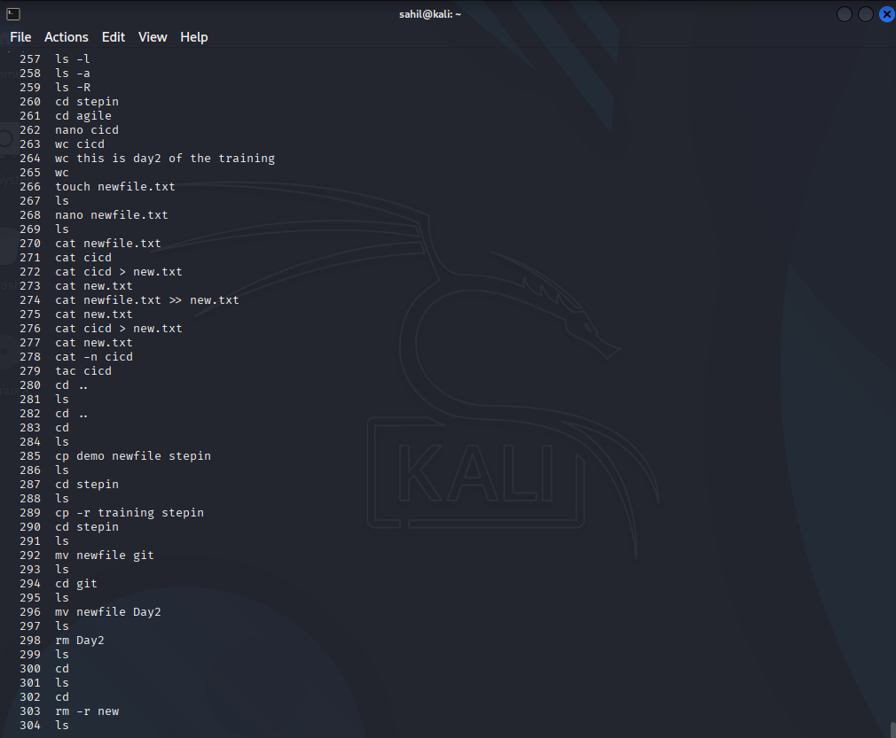
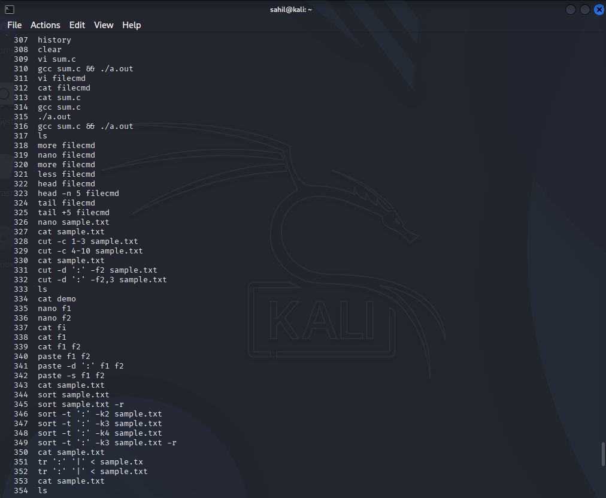
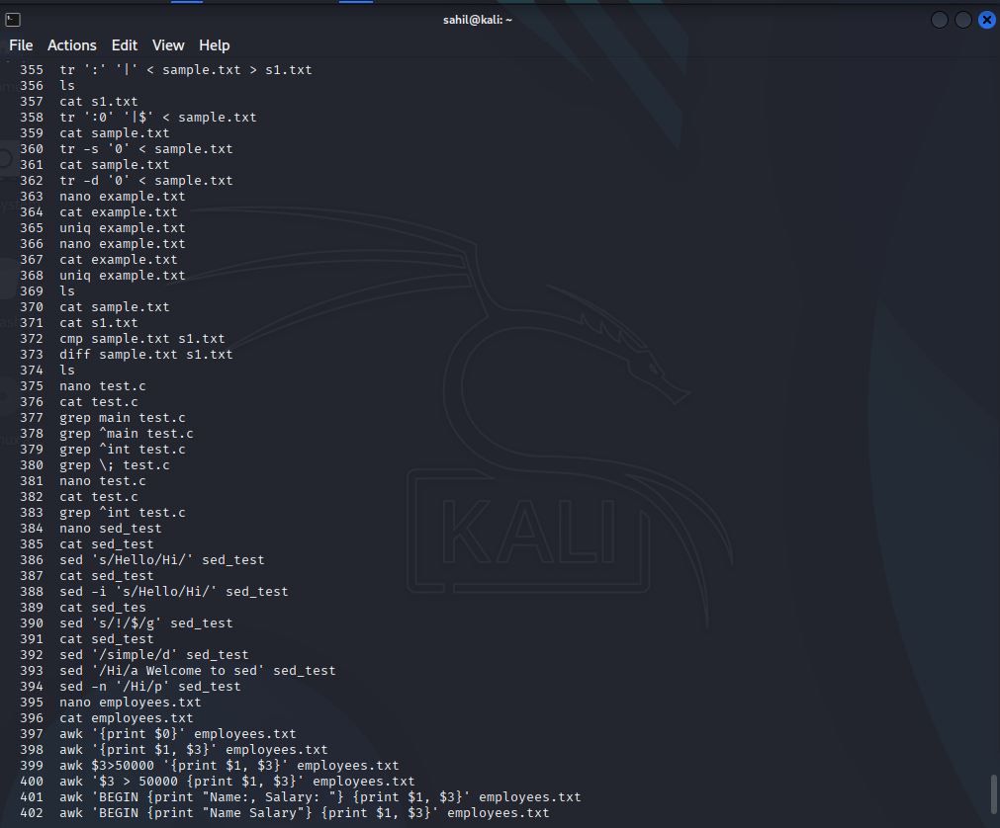
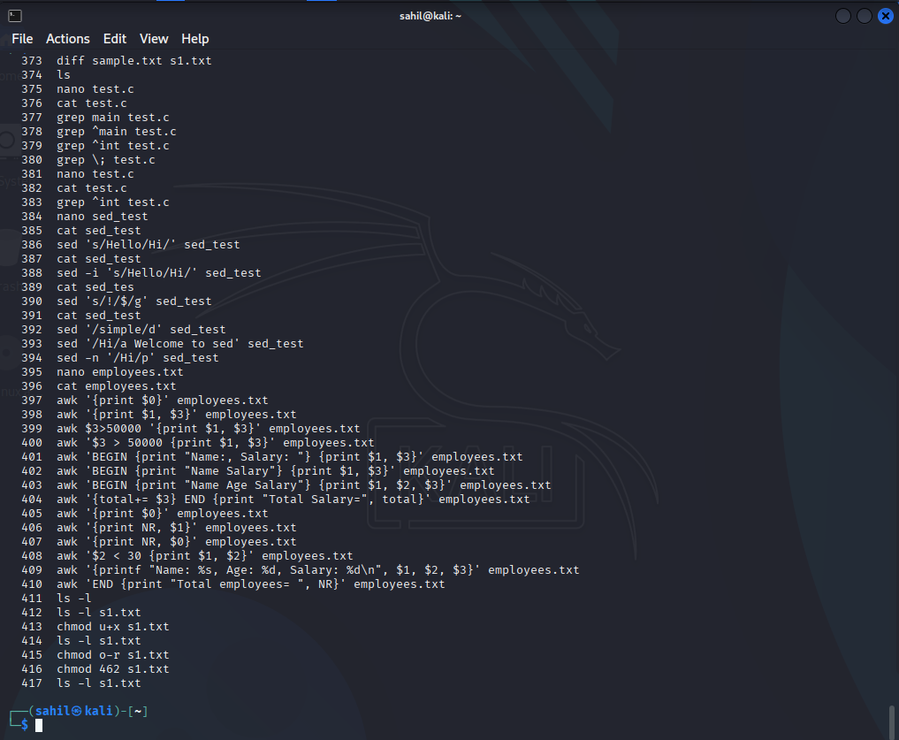

# 🐧 Linux Practice – Command History Logs

This folder contains screenshots of Linux terminal sessions, organized **day-wise** and **chronologically**, as part of my LTTS STEPIn Pre-Joining Training. These logs document my hands-on practice with over **400 Linux commands**, categorized across key system operations.

---

## 📅 Day 1 – Shell Basics & Environment Commands

| Screenshot | Description |
|------------|-------------|
|  | Initiated session, explored `date`, `bc`, `echo`, `whoami`, `rev`, etc. |
|  | Practiced `whatis`, `whereis`, `man`, and initial system inspection. |
|  | Used `date` formatting with options and `ncal` for calendar navigation. |
|  | Explored help commands and usage of `info`, `seq`, `printenv`. |

---

## 📅 Day 2 – Software Installation & File Operations

| Screenshot | Description |
|------------|-------------|
|  | Ran `apt update`, `apt upgrade`, checked env vars, `ls`, `mkdir`, `touch`. |
|  | Installed packages with `apt install`, `build-essential`, worked with directories. |
|  | Advanced usage of `nano`, `cat`, `wc`, `tac`, and file exploration. |

---

## 📅 Day 3 – Compilation & Terminal Proficiency

| Screenshot | Description |
|------------|-------------|
|  | Used `clear`, `cal`, and captured terminal history for documentation. |
|  | Organized files, managed folder structure, and reviewed command logs. |
|  | Compiled a simple C program using `gcc` and verified outputs. |

---

## 📁 Folder Snapshot

```text
LINUX/
├── D1S1.png
├── D1S2.png
├── D1S3.png
├── D1S4.png
├── D2S1.png
├── D2S2.png
├── D2S3.png
├── D3S1.png
├── D3S2.png
└── D3S3.png
