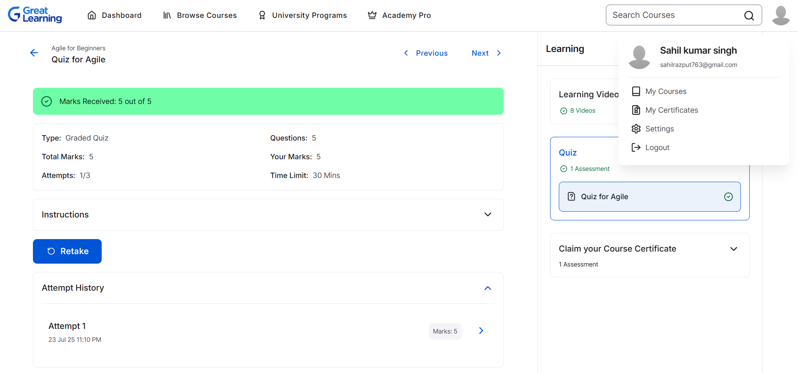

# 5420267_Sahil-Kumar-Singh
# 💼 LTTS STEPIn Training Portfolio

Welcome to my personal repository showcasing my journey through the **LTTS STEPIn Pre-Joining Training Program**. This repository includes module summaries, activities, and verified proof of completion. 🚀

---

## 📘 Week 1 – Module 1: *Understanding SDLC, Agile & Testing Practices*

- Explored various **Software Development Life Cycle (SDLC)** models.
- Gained knowledge about **Agile methodologies** and testing strategies.
- Completed Agile fundamentals with **full score**. ✅

### 📸 Agile Module Quiz Result:

---

## 🔧 Week 2 – Module 2: *Mastering Git & Collaborative Version Control*

- Learned essential Git operations: **branching, committing, merging**, and using **GitHub**.
- Practiced using local and remote Git repositories.
- Earned certificate for Git training from **Simplilearn**.

### 🏆 Git Certificate Preview:

## 📌 Highlights

- 🧠 Knowledge of development models and agile workflows.
- 🛠️ Hands-on experience with Git and GitHub.
- 📝 Certified proof of learning and participation.

---

## 🖥️ Week 3 – Module 3: *Mastering Linux Command Line*

- Practiced and executed over **400 Linux commands** across 3+ days of hands-on sessions.
- Gained deep understanding of:
  - 📅 **Date and time formatting** using `date`, `cal`, `ncal`
  - 🧮 **Command-line math** with `bc`, `expr`
  - 🐧 **System information utilities**: `uname`, `whoami`, `printenv`, `echo`, `seq`, `rev`
  - 📂 **File and directory operations**: `ls`, `cd`, `mkdir`, `mv`, `cp`, `touch`, `nano`, `cat`, `wc`, `tac`
  - 🧠 **Command lookup tools**: `whatis`, `whereis`, `info`, `man`
  - ⚙️ **Package management** using `apt`, `sudo`, and essential package installations
- Developed proficiency in shell scripting basics (`echo`, `printf`, redirection), and terminal-based navigation.

### 📸 Terminal Screenshot Evidence:
All screenshots and command history logs are stored in the [`LINUX/`](LINUX/) folder. Screenshots are organized **day-wise** and represent different stages of hands-on Linux practice:

| Day | Description | Screenshot Links |
|-----|-------------|------------------|
| Day 1 | Shell basics, date, bc, environment, and intro to commands | `D1S1.png` to `D1S4.png` |
| Day 2 | Package installation, advanced `date`, `cal`, `info`, and file commands | `D2S1.png` to `D2S3.png` |
| Day 3 | File operations, redirection, C program compilation using `gcc`, and cleanup | `D3S1.png` to `D3S3.png` |

> 📂 Explore the [`LINUX/README.md`](LINUX/README.md) file for a detailed breakdown with image previews.

---

## 🧠 Key Takeaways

- ✅ Practiced **real-world Linux terminal usage** and command workflows.
- ✅ Demonstrated **terminal fluency** by working with over 400 commands.
- ✅ Used tools like `gcc`, `nano`, `cat`, and `bc` to explore both scripting and compiling aspects.
- 📸 Documented progress clearly using organized screenshots.

> ✨ *This marks the completion of my third week in the LTTS STEPIn Training Program, with strong command-line confidence and working knowledge of Linux.*

> ✨ *This repository serves as a digital portfolio of my pre-joining training program with LTTS.*
